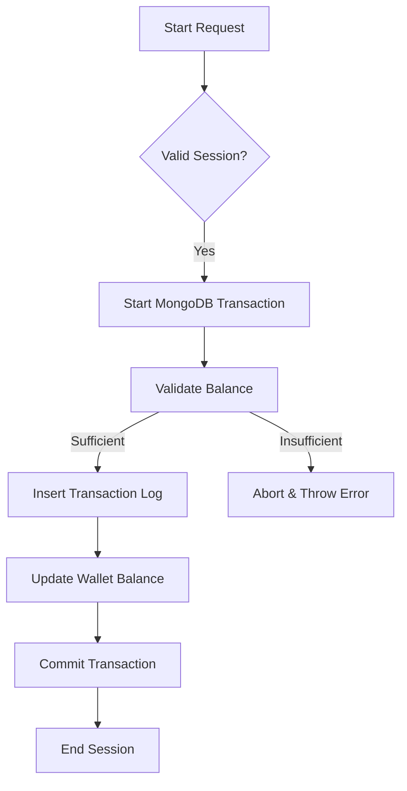

# LedgerX – Business Admin & Wallet Dashboard

LedgerX is a production-grade business admin dashboard designed to manage users, wallets, transactions, and financial reports with strict role-based access control and auditability.

> [!IMPORTANT]
> This is a production-level simulation. All financial operations are atomic, idempotent, and fully audited.

## 🚀 Live Demo
- **Frontend:** [ledgerx.vercel.app](https://ledgerx.vercel.app) (Demo Link)
- **Backend API:** [ledgerx-api.onrender.com/api/v1](https://ledgerx-api.onrender.com/api/v1) (Demo Link)

**Test Admin Login:**
- **Email:** `admin@test.com`
- **Password:** `Admin@123`

## 🧠 Why This Project?
Most demo dashboards ignore core fintech principles. LedgerX implements:
- **Atomic Transactions:** No partial failures. Wallet updates and transaction logging happen in a single MongoDB session.
- **Audit Integrity:** Every sensitive action is logged in an immutable `audit_logs` collection.
- **Scalable Reporting:** Financial reports are precomputed via `node-cron` snapshots to ensure O(1) dashboard loading times.
- **Idempotent Operations:** Unique reference IDs prevent duplicate processing (double-spend/double-credit).

## 🧩 Core Features
- 🔐 **Auth & Security:** JWT (Access + Refresh Tokens) with bcrypt and secure route guards.
- 👥 **RBAC:** Multi-tenant roles (ADMIN, MANAGER, USER) with middleware-enforced permissions.
- 💰 **Wallet System:** Usable balance tracking with precision-safe arithmetic.
- 📜 **Transaction Engine:** Immutable history with full before/after balance audit.
- 📊 **Analytics:** Daily and monthly snapshots with chart-ready data aggregation.
- 🌗 **Premium UI:** sleek dark/light mode dashboard with server-side pagination and skeleton loaders.

## 🛠 Tech Stack
### Backend
- **Core:** Node.js, TypeScript, Express.js
- **Database:** MongoDB Atlas, Mongoose
- **Security:** JWT (Passport-less), bcrypt, Zod
- **Tasks:** Node-cron

### Frontend
- **Framework:** Next.js (App Router), TypeScript
- **Styling:** Tailwind CSS (Custom Design System)
- **Data Fetching:** TanStack Query, Axios
- **Visualization:** Recharts / Chart.js

## 📁 Repository Structure
```text
src/
 ├─ backend/           # Express API
 │   ├─ modules/       # Domain-driven modules (Auth, Wallet, etc.)
 │   ├─ models/        # Mongoose schemas
 │   ├─ cron/          # Scheduled report snapshotters
 │   └─ utils/         # Atomic transaction helpers
 └─ frontend/          # Next.js Application
     ├─ app/           # App router pages
     ├─ components/    # Reusable UI/Layout components
     └─ lib/           # API clients & types
```

## 🔄 Wallet Transaction Flow (Atomic)


## ⚙️ Setup Instructions
1. **Clone & Install:**
   ```bash
   git clone https://github.com/Govindghosh/LedgerX.git
   cd LedgerX && npm install
   ```
2. **Backend Config (.env):**
   ```text
   MONGO_URI=your_mongodb_uri
   JWT_SECRET=your_secret
   ```
3. **Frontend Config (.env):**
   ```text
   NEXT_PUBLIC_API_URL=http://localhost:5000/api/v1
   ```
4. **Run:**
   ```bash
   npm run dev
   ```

## 👨‍💻 Author
**Govind Ghosh**  
Full-Stack Developer (MERN / Next.js)  
[GitHub](https://github.com/Govindghosh) | [LinkedIn](https://linkedin.com/in/govindghosh)

---
*"LedgerX handles wallet mutations atomically with full auditability and precomputed financial reporting."*
